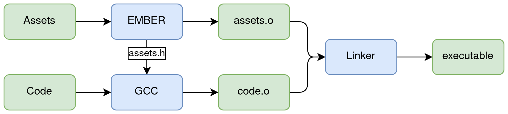

## Ember
CMake based library for embedding resources into object files and executables. Ember consists of a C++17
command line application that can "compile" binary resources into object files (both ELF and PE/COFF) that can be
linked into other libraries or executables, and of a CMake script that provieds a function that allows one 
to easily use ember in their build process.  

Overview of the ember assisted compilation pipeline, the use of GCC is purely exemplary, in fact, Ember support 
both Linux and Windows specific compilers and linkers.

<picture>
  <source media="(prefers-color-scheme: dark)" srcset="./.github/ember-pipeline-dark.png">
  
</picture>

### CMake Usage Example
```cmake
# We use fetch content as it's easy
include(FetchContent)

# Clone EMBER into local project
FetchContent_Declare(ember
	GIT_REPOSITORY https://github.com/magistermaks/ember
	GIT_TAG v1.1.0
)

# You most likely want this, otherwise ember will create a lot of test targets
set(EMBER_ENABLE_TESTS OFF CACHE BOOL "" FORCE)

# Add 'ember' to your _MakeAvailable 
FetchContent_MakeAvailable(ember)

# If you intend to use the Ember-generated header 
# files make sure to look for them!
include_directories(${CMAKE_CURRENT_BINARY_DIR})

# Create a new library 'default_assets'. The 'HEADER' option instructs ember to generate the header file as well
# For the syntax of the 'ARGS' block see ember CLI (the Symbol Flags)
add_ember(default_assets HEADER ARGS
	--file assets/font.ttf --name default_font_ttf
	--file assets/texture.png --name default_texture_png
)

# If you are going with the header add it the source list to 
# create a dependency during build
add_executable(main 
	${MY_SOURCES}
		
	# Header path will be in 'MY_EMBER_TARGET'_header variable
	# but that variable will only be create if 'HEADER' is passed to add_ember!
	${default_assets_header}
)

# Finally link with the ember created library along with all your other dependencies
target_link_libraries(main
	default_assets
)
```

### C/C++ Usage Example
```c
// Assuming the setup from above is used to compile this
#include <default_assets.h>
#include <stdio.h>

int main() {
	printf("Font size: %d bytes", (int) sizeof(default_font_ttf));
	printf("Texture size: %d bytes", (int) sizeof(default_texture_png));
	
	// default_font_ttf and default_texture_png are now const char arrays that you can
	// use in your code, as long as the ember generated object file is linked 
	
	return 0;
}
```

### CLI Usage Example
```bash
# Generate ELF file and a header from the foo.txt and bar.txt files
# After the flag '--file' (or '-f') is read by ember only symbols can be defined (more files to embed)
ember --elf ./assets.o --header ./assets.h --file foo.txt --file bar.txt

# Change the default name given to a embedded symbol using '--name' ('-n')
# Note that all symbol flags always affect the previously specified file
ember --coff ./assets.obj --file hello.txt --name file_hello_txt --file bye.txt --name file_bye_txt

# The are other options you can specify for each symbol
# To learn more use: ember --help
ember -E ./assets.o -H ./assets.h --file /dev/null --limit 1000 --name file_zeros 
```
